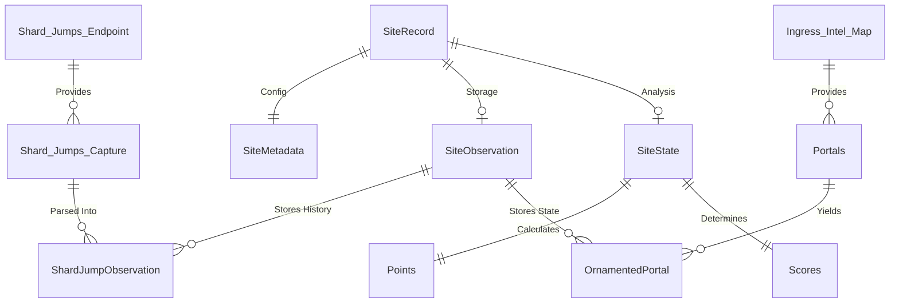

# Conceptual Data Schema

This document illustrates the structural relationships between the domain models used across the `ingress-events-core` project. Rather than defining strict property structures (which are maintained definitively in the TypeScript types), this schema visualizes how raw data flows from capture into final event standings.

## Entity Relationship Flow

The data models map to the [Classic Data Lifecycle](./Architecture.md#classic-data-lifecycle) and are unified within the **SiteRecord** container.

## Layer Definitions

### 1. Root Container: SiteRecord
The `SiteRecord` is the primary domain entity representing the complete lifecycle of a single event site. It acts as the "Shoebox" for everything known about that site.

- **metadata**: Static configuration, geocode, and scheduling information (Stage 3).
- **observations**: The raw processed state and historical jump data (Stage 4).
- **analysis**: The enriched results, point tallies, and faction scores (Stage 5).

### 2. Storage Layer (SiteObservation)
The storage layer defines the "Document Persistence Model" (JSON representations) of what has been seen on the map.

- **ShardJumpObservation**: A simplified record of a shard movement, stripped of wire-protocol artifacts.
- **OrnamentedPortal**: Captures indicators like `BattleBeacon` and `Volatile` elements exactly as rendered on the portal network.

### 3. Analysis Layer (SiteState)
The analysis layer enriches the stored observation data to produce rule-based standings.

- **SiteState**: A snapshot of the site's competitive state (e.g., at a specific wave).
- **Points**: Raw accounting totals (e.g., jump counts).
- **Scores**: The final verdict or rule-based point allocation.

---

### **Related Documentation**
- [Architecture & Lifecycle](./Architecture.md)
- [Game Mechanics](./mechanics/README.md)
