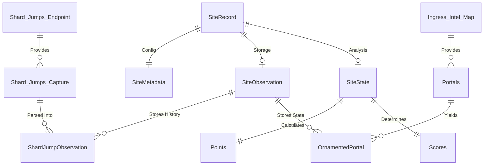

# Conceptual Data Schema

This document illustrates the structural relationships between the domain models used across the `ingress-events-core` project. Rather than defining strict property structures (which are maintained definitively in the TypeScript types), this schema visualizes how raw data flows from capture into final event standings.

## Incoming Data Streams

To understand the domain schema, it is critical to distinguish the two fundamentally different raw data feeds that enter the system:

1. **The Point-in-Time Snapshot (IITC Map Scans)**
   * **Nature**: A direct snapshot of the map state at the moment of capture.
   * **Format**: It provides spatial data regarding static features attached to portals, specifically ornaments (e.g., Anomaly portals before an event, Battle Beacons during an event).
   * **Challenge**: Generates high-frequency, duplicated point-in-time data if captured constantly.

2. **The Historical Event Stream (Niantic Endpoint)**
   * **Nature**: An historical, chronological view of recent events.
   * **Format**: It provides spatial movement data (shard jumps). Each artifact/fragment represents a site, providing a complete historical view of the site from the present moment backward into the past.
   * **Challenge**: Disconnected from the real-time, instantaneous map state.

While both streams provide *spatial data*, they are completely different in their temporal orientation (Snapshot vs. Historical). Because of this, our domain models must respect their unique structures rather than forcing them into a single, unified format during the observation phase.

### Observation Strategies

Because of the differences in the incoming data streams, the observation layer handles data retention differently:

- **Point-in-Time Snapshots (Wipe-and-Replace)**: Since IITC Map Scans represent the absolute state of the map at the moment of capture, the system supports a manual "wipe-and-replace" feature via the observer plugin. Rather than automatically tracking removals, users can manually clear all pre-event ornaments for a site and replace them entirely with a fresh scan. This prevents the need for complex state-diffing or calculating "removed" events.
- **Historical Event Stream (Immutable Append)**: Since Shard Jumps are chronological events, they are immutably appended to the shard's history log.

**Note on Battle Beacons:**
Battle beacons are represented by several concurrent explicit ornaments on the map, rather than abstract states. These include:
- `peBB_BATTLE_RARE` (Niantic deployed event beacon)
- `ap1` (Standard duration indicator)
- `ap1_v` (Volatile duration indicator)
- `peBN_ENL_WINNER` / `peBN_RES_WINNER` / `peBN_TIED_WINNER` (Post-battle victory state markers)

## Entity Relationship Flow
The data models map to the [Classic Data Lifecycle](./Architecture.md#classic-data-lifecycle) and are unified within the **SiteRecord** container.

## Layer Definitions

### 1. Root Container: SiteRecord
The `SiteRecord` is the primary domain entity representing the complete lifecycle of a single event site. It acts as the "Shoebox" for everything known about that site.

- **metadata**: Static configuration, geocode, and scheduling information (Stage 3).
- **observations**: The raw processed state and historical jump data (Stage 4).
- **analysis**: The enriched results, point tallies, and faction scores (Stage 5).

### 2. Storage Layer (SiteObservation)
The storage layer defines the "Document Persistence Model" (JSON representations) of what has been seen on the map.

- **ShardJumpObservation**: A simplified record of a shard movement, stripped of wire-protocol artifacts.
- **OrnamentedPortal**: Captures indicators like `BattleBeacon` and `Volatile` elements exactly as rendered on the portal network.

### 3. Analysis Layer (SiteState)
The analysis layer enriches the stored observation data to produce rule-based standings.

- **SiteState**: A snapshot of the site's competitive state (e.g., at a specific wave).
- **Points**: Raw accounting totals (e.g., jump counts).
- **Scores**: The final verdict or rule-based point allocation.

---

### **Related Documentation**
- [Architecture & Lifecycle](./Architecture.md)
- [Game Mechanics](./mechanics/README.md)
